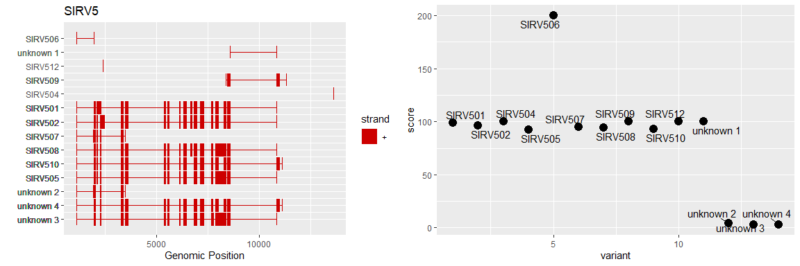
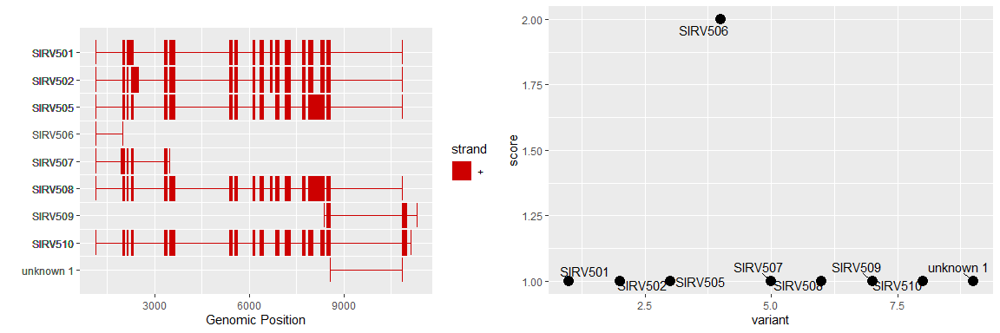
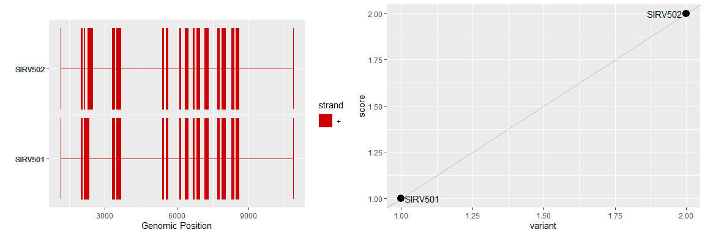
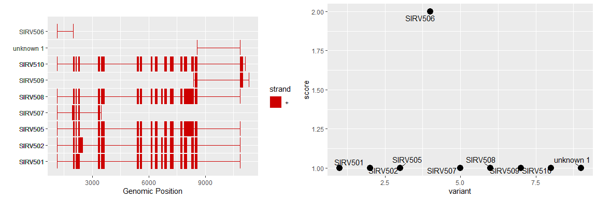
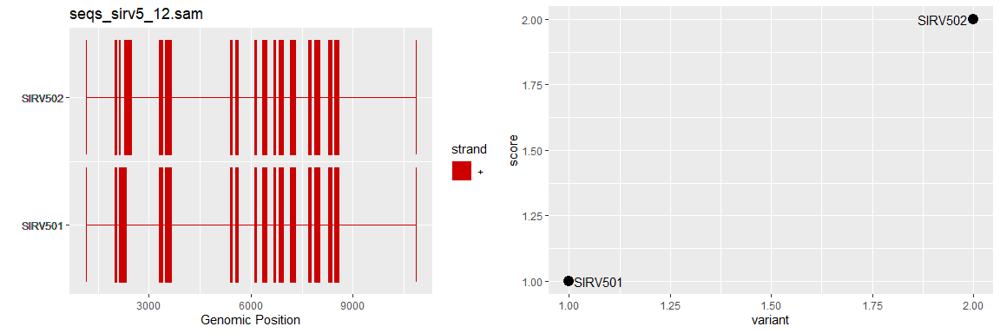
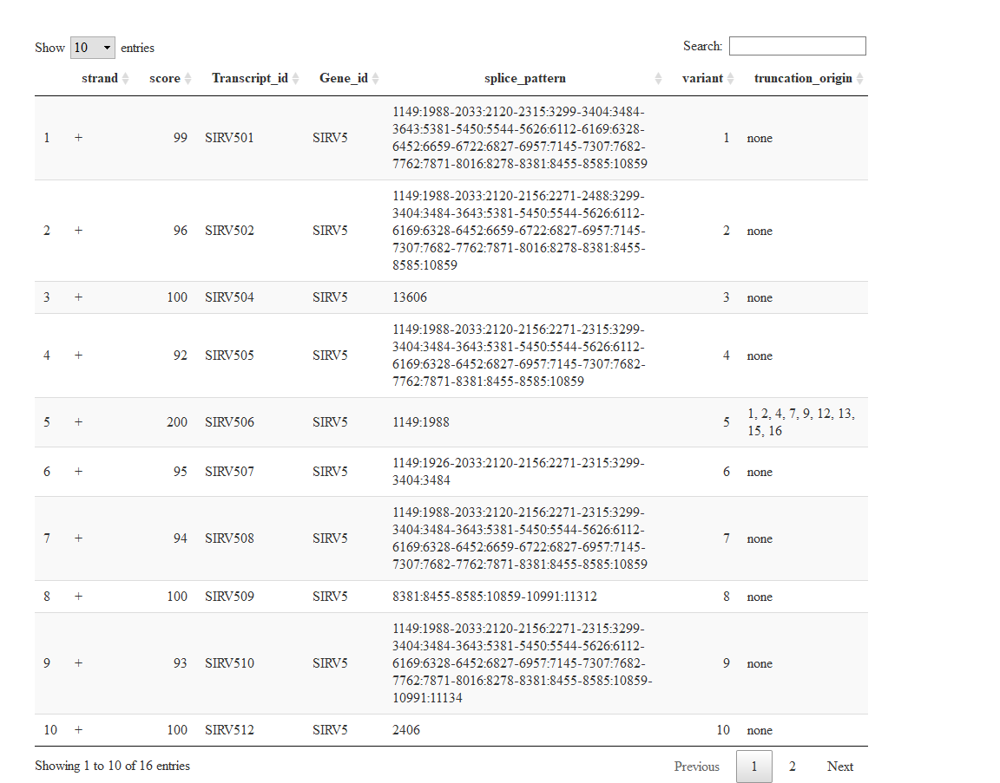

# nexonsAnalysis

R functions for analysis and graphical representation of output from
nexons

``` r
devtools::install_github("laurabiggins/nexonsAnalysis")
library(nexonsAnalysis)
```

# Example data and plot

## Using nexons gtf output

Nexons can produce output in 2 different formats. One we will refer to
as the “default nexons output”, the other is in gtf format. This package
was originally designed to work with the gtf format, but it can also use
the default nexons output. The example below using the `plot_wrapper()`
function is a very simple example that does not allow many arguments to
be specified and will only work with the nexons gtf file output.

``` r
file <- system.file("extdata", "nexons_sirv5_f15.gtf", package = "nexonsAnalysis")
plot_wrapper(file, min_count = 5, quant_plot = TRUE)
```

    FALSE [1] "No ordering of y axis specified"


The above example can be reproduced using the individual functions that
`plot_wrapper()` is a wrapper around. This allows more options to be
specified. The `order_splices` argument in draw_splice_picture accepts
one of (one of ‘score’, ‘name’, NULL) default NULL. This refers to the
ordering of the splices on the y axis (on the left hand plot), ‘score’
will sort data by score (highest at the top), ‘name’ will sort data
alphabetically (with unknowns at the bottom). `draw_splice_picture` also
allows a particular gene to be specified with the `gene` argument.

``` r
file <- system.file("extdata", "nexons_sirv5_f15.gtf", package = "nexonsAnalysis")
nexons_output <- readr::read_delim(file)
parsed_splices <- parse_nexons_gtf(nexons_output, min_count = 3)
draw_splice_picture(parsed_splices, quant = TRUE, order_splices = "score", gene="SIRV5")
```



## Using default nexons output

### For one sample at a time

``` r
file <- system.file("extdata", "sirv5.txt", package = "nexonsAnalysis")
nexons_output <- readr::read_delim(file)
parsed_splices <- parse_default_nexons(nexons_output, score_column = "seqs_sirv5_minimap.sam")
draw_splice_picture(parsed_splices, quant = TRUE, order_splices = "name")
```



### For multiple samples

Use purrr::map to iterate over multiple datasets.

``` r
file <- system.file("extdata", "sirv5.txt", package = "nexonsAnalysis")
nexons_output <- readr::read_delim(file)
# get names of datasets - there are 2 in this file
count_columns <- tail(colnames(nexons_output), n=2)
parsed_splices <- purrr::map(count_columns, parse_default_nexons, nexons_output=nexons_output)
p <- purrr::map(parsed_splices, draw_splice_picture, quant=TRUE, order_splices = "score")
```



### Adding titles to the plots

``` r
file <- system.file("extdata", "sirv5.txt", package = "nexonsAnalysis")
nexons_output <- readr::read_delim(file)
# get names of datasets - there are 2 in this file
count_columns <- tail(colnames(nexons_output), n=2)
parsed_splices <- purrr::map(count_columns, parse_default_nexons, nexons_output=nexons_output) |>
  purrr::set_names(count_columns)
p <- purrr::imap(parsed_splices, ~ draw_splice_picture(.x, title_text=.y, quant=TRUE, order_splices = "score"))
```



## Flagging up potentially truncated reads

The function `identifyPotentialTruncations` identifies whether
transcripts might be truncations of other transcripts. It adds an
additional column to the tibble named truncation_origin. The flexibility
parameter refers to the difference in location (number of bases) to
still be classified as a match. For exact matches set flexibility to 0.
Default is 10.

``` r
file <- system.file("extdata", "nexons_sirv5_f15_trunc.txt", package = "nexonsAnalysis")
nexons_output <- readr::read_delim(file)
parsed_splices <- parse_nexons_gtf(nexons_output, min_count = 3)

parsed_with_trunc <- identifyPotentialTruncations(parsed_splices, flexibility = 10)
DT::datatable(parsed_with_trunc)
```



## Flagging up truncations

This also works with the default nexons output as well as the gtf
output.

``` r
file <- system.file("extdata", "sirv5.txt", package = "nexonsAnalysis")
nexons_output <- readr::read_delim(file)
parsed_splices <- parse_default_nexons(nexons_output, score_column = "seqs_sirv5_minimap.sam")
parsed_default_with_trunc <- identifyPotentialTruncations(parsed_splices, flexibility = 10)
knitr::kable(parsed_default_with_trunc)
```

| Gene_id | Gene Name | Chr   | strand | splice_pattern                                                                                                                                                               | Transcript_id | seqs_sirv5_12.sam | score | variant | truncation_origin |
|:--|:---|:--|:--|:----------------------------------------|:----|-----:|--:|--:|:-----|
| SIRV5   | SIRV5     | SIRV5 | \+     | 1149:1988-2033:2120-2315:3299-3404:3484-3643:5381-5450:5544-5626:6112-6169:6328-6452:6659-6722:6827-6957:7145-7307:7682-7762:7871-8016:8278-8381:8455-8585:10859             | SIRV501       |                 1 |     1 |       1 | none              |
| SIRV5   | SIRV5     | SIRV5 | \+     | 1149:1988-2033:2120-2156:2271-2488:3299-3404:3484-3643:5381-5450:5544-5626:6112-6169:6328-6452:6659-6722:6827-6957:7145-7307:7682-7762:7871-8016:8278-8381:8455-8585:10859   | SIRV502       |                 2 |     1 |       2 | none              |
| SIRV5   | SIRV5     | SIRV5 | \+     | 1149:1988-2033:2120-2156:2271-2315:3299-3404:3484-3643:5381-5450:5544-5626:6112-6169:6328-6452:6827-6957:7145-7307:7682-7762:7871-8381:8455-8585:10859                       | SIRV505       |                 0 |     1 |       3 | none              |
| SIRV5   | SIRV5     | SIRV5 | \+     | 1149:1988                                                                                                                                                                    | SIRV506       |                 0 |     2 |       4 | 1, 2, 3, 6, 8     |
| SIRV5   | SIRV5     | SIRV5 | \+     | 1149:1926-2033:2120-2156:2271-2315:3299-3404:3484                                                                                                                            | SIRV507       |                 0 |     1 |       5 | none              |
| SIRV5   | SIRV5     | SIRV5 | \+     | 1149:1988-2033:2120-2156:2271-2315:3299-3404:3484-3643:5381-5450:5544-5626:6112-6169:6328-6452:6659-6722:6827-6957:7145-7307:7682-7762:7871-8381:8455-8585:10859             | SIRV508       |                 0 |     1 |       6 | none              |
| SIRV5   | SIRV5     | SIRV5 | \+     | 8381:8455-8585:10859-10991:11312                                                                                                                                             | SIRV509       |                 0 |     1 |       7 | none              |
| SIRV5   | SIRV5     | SIRV5 | \+     | 1149:1988-2033:2120-2156:2271-2315:3299-3404:3484-3643:5381-5450:5544-5626:6112-6169:6328-6452:6827-6957:7145-7307:7682-7762:7871-8016:8278-8381:8455-8585:10859-10991:11134 | SIRV510       |                 0 |     1 |       8 | none              |
| SIRV5   | SIRV5     | SIRV5 | \+     | 8585:10859                                                                                                                                                                   | unknown       |                 0 |     1 |       9 | 1, 2, 3, 6, 7, 8  |
