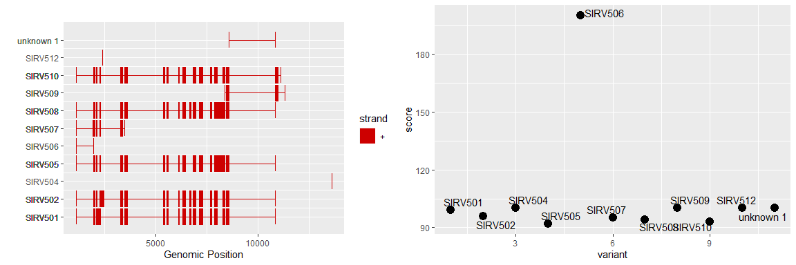

# nexonsAnalysis

R functions for analysis and graphical representation of output from
nexons

``` r
devtools::install_github("laurabiggins/nexonsAnalysis")
library(nexonsAnalysis)
```

# Example data and plot

``` r
file <- system.file("extdata", "nexons_sirv5_f15.gtf", package = "nexonsAnalysis")
plot_wrapper(file, min_count = 5, quant_plot = TRUE)
```


